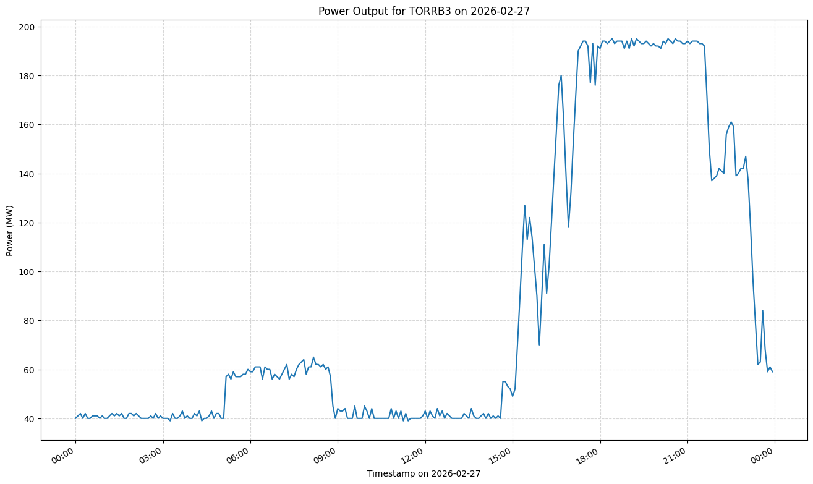

Creates a simple API to extract power plant output over the course of a day, for power plants in the Australian NEM (National Electricity Market). The aim is to make this data more accessible for analysis.

See a live instance running on [http://nem.30hours.dev](http://nem.30hours.dev).

## API

The following functionality is available:

- Show all available power plants. This provides a CSV of power plant IDs which can be used in power output queries.

  ```
  /api/plants
  ```

  ```
  id, name, type, state, capacity
  ADPBA1,Adelaide Desalination Plant,Battery Storage,SA,7.76
  ADPPV1,Adelaide Desalination Plant,Solar PV,SA,2.75
  ADPPV2,Adelaide Desalination Plant,Solar PV,SA,2.75
  ADVMH1,Adelaide Desalination Plant,Hydro,SA,1.0
  AGLHAL,Hallett Power Station,Gas Turbine,SA,276.86
  AGLSOM,Somerton,Gas Turbine,VIC,170.0
  ```

- Get the power plant output in MW for a specified date for each 5 minute interval. This provides a CSV list of ISO timestamp and power output in MW.

  ```
  /api/<plant_id>/20260221
  ```

  ```
  timestamp, power_mw
  2026-02-21T00:00:00, 101.2
  2026-02-21T00:05:00, 103.4
  2026-02-21T00:10:00, 102.3
  ```

- Get the power plant output in MW for today for each 5 minute interval. Same as above but for today.

  ```
  /api/<plant_id>/today
  ```

  ```
  2026-02-21T00:00:00, 101.2
  2026-02-21T00:05:00, 103.4
  2026-02-21T00:10:00, 102.3
  ```

- Plot the power plant output for a single day as per above. Simply add `/plot` to the API endpoint.

  ```
  /api/<plant_id>/20260227/plot
  /api/TORRB3/20260227/plot
  ```

  

## Usage

Build and run using Docker.

```
sudo docker compose up -d --build
```

The API will be available at `http://localhost:8000/api`.

## Architecture

The program consists of 3 Docker containers.

- `nempow-server` is a Python backend that polls the files of interest, and updates the Postgres database.
- `nempow-db` is a Postgres database which stores the data in a table `power` with columns `timestamp_iso`, `plant_id` and `power_mw`. Also has a table `plant` which stores columns `id`, `name`, `type`, `state` and `capacity`.
- `nempow-api` extracts the data of interest from the Postgres database and provides API access.

## Data Sources

The current data format is a zipped CSV file representing a 5 minute interval. It described power plants with their ID (DUID) and the power output in MW for that 5 minute period (SCADAVALUE). The current data (storing 3 days worth of 5 minute interval data) can be found here: [https://www.nemweb.com.au/REPORTS/CURRENT/Dispatch_SCADA/](https://www.nemweb.com.au/REPORTS/CURRENT/Dispatch_SCADA/).

An example of the CSV format is given below:

```
C,NEMP.WORLD,DISPATCHSCADA,AEMO,PUBLIC,2026/02/21,19:45:14,0000000504525936,DISPATCHSCADA,0000000504525930
I,DISPATCH,UNIT_SCADA,1,SETTLEMENTDATE,DUID,SCADAVALUE,LASTCHANGED
D,DISPATCH,UNIT_SCADA,1,"2026/02/21 19:50:00",BARCSF1,0.20,"2026/02/21 19:45:13"
D,DISPATCH,UNIT_SCADA,1,"2026/02/21 19:50:00",BUTLERSG,8.200001,"2026/02/21 19:45:13"
D,DISPATCH,UNIT_SCADA,1,"2026/02/21 19:50:00",BWTR1,24.978920,"2026/02/21 19:45:13"
D,DISPATCH,UNIT_SCADA,1,"2026/02/21 19:50:00",CAPTL_WF,83.098923,"2026/02/21 19:45:13"
D,DISPATCH,UNIT_SCADA,1,"2026/02/21 19:50:00",CHALLHWF,5.20,"2026/02/21 19:45:13"
D,DISPATCH,UNIT_SCADA,1,"2026/02/21 19:50:00",CLOVER,0,"2026/02/21 19:45:13"
D,DISPATCH,UNIT_SCADA,1,"2026/02/21 19:50:00",CLUNY,2.309453,"2026/02/21 19:45:13"
D,DISPATCH,UNIT_SCADA,1,"2026/02/21 19:50:00",CONDONG1,24.709999,"2026/02/21 19:45:13"
D,DISPATCH,UNIT_SCADA,1,"2026/02/21 19:50:00",CULLRGWF,27.59,"2026/02/21 19:45:13"
D,DISPATCH,UNIT_SCADA,1,"2026/02/21 19:50:00",DIAPURWF1,0.70,"2026/02/21 19:45:13"
```

The archive data format is a zipped file which has 288 sub-zipped CSV files, representing each 5 minute interval in the day. Each of the sub-ZIP files contains a CSV with the power output in MW of each power plant in that 5 minute interval. Note the top level zipped file is only updated once a day. The archive data (storing a years worth of data) can be found here: [https://www.nemweb.com.au/REPORTS/ARCHIVE/Dispatch_SCADA/](https://www.nemweb.com.au/REPORTS/ARCHIVE/Dispatch_SCADA/).

Also of interest is the power plant information mapping name, ID, location and capacity factor. The capacity factor is the most interesting as it tells us what ratio of the full output is currently being used. This information can be extracted from the [General Information](https://www.aemo.com.au/energy-systems/electricity/national-electricity-market-nem/nem-forecasting-and-planning/forecasting-and-planning-data/generation-information) spreadsheet under the `Generator Information` sheet. This file is stored locally in the repo as there is no generic link. 

## Notes

- NEM time is a constant UTC+10 all year round and does not observe daylight savings. Brisbane just happens to be NEM time as they do not observe daylight savings, therefore the timezone is set to `Australia/Brisbane` in the API container.

## Future Work

Generate `matplotlib` plots for daily/weekly summaries.

If there is interest, the API can be extended for other parameters than just output power.

## Acknowledgements

The page at [https://anero.id/](https://anero.id/) by Andrew Miskelly was the motivation for this. The plots produced are awesome, the aim of this project is just to expose the raw data used to generate the daily plots.

Credit to AEMO for providing [NEM Web](https://www.aemo.com.au/energy-systems/electricity/national-electricity-market-nem/data-nem/market-data-nemweb).

[MIT](https://choosealicense.com/licenses/mit/) license.